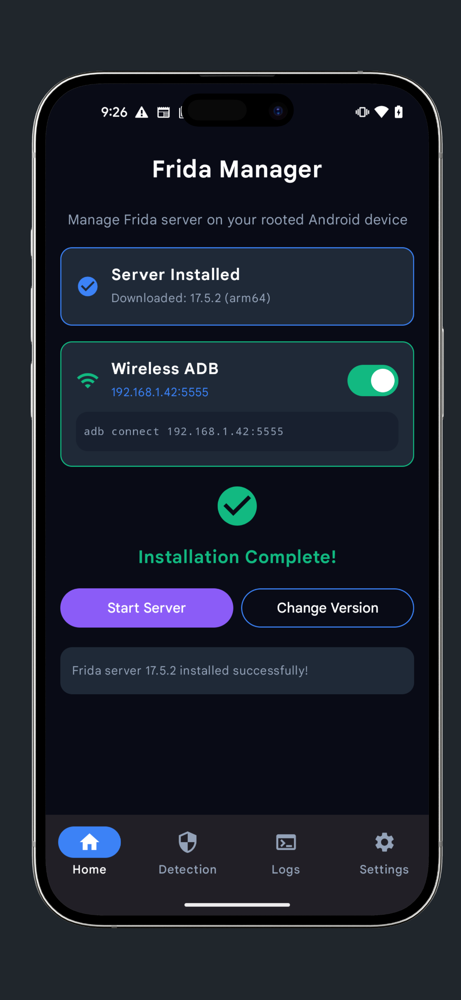

<div align="center">
  

  <h1 align="center">Frida Manager</h1>

  <p align="center">
    <strong>The Ultimate Tool for Android Security Research & Frida Orchestration</strong>
  </p>
  
  <p align="center">
    <!-- Badges -->
    <a href="https://github.com/yvikash18/frida-server-manager-android/actions/workflows/android.yml"></a>
    <a href="https://github.com/yvikash18/frida-server-manager-android/releases"></a>
    
    
  </p>
</div>

---

## 🔥 Overview

**Frida Manager** is a cutting-edge Android application designed for security researchers, pentesters, and modders. It streamlines the deployment of Frida server binaries and provides a robust **RASP (Runtime Application Self-Protection) Detection** suite to analyze how apps detect your environment.

With a beautiful **Material Design 3** interface, it offers powerful tools like **Wireless ADB Debugging**, real-time logging, and one-click environment scans.

## ✨ Key Features

### 🚀 Advanced Server Management
- **Smart Installation**: Auto-fetch and install the latest Frida binaries from GitHub.
- **Version Control**: Save multiple Frida versions and switch between them instantly.
- **Auto-Heal**: Automatically detects architecture and installs the correct binary.
- **Boot Persistence**: Configure Frida server to start automatically on device boot.

### 🛡️ RASP & Environment Analysis
Detect if your environment is exposed to anti-tampering checks. Our native detection module scans for:
- 🕵️ **Maps & Smaps Scanning**: Detects Frida libraries and anonymous executable memory.
- 🧵 **Thread Analysis**: Identifies suspicious threads (`gmain`, `gum-js-loop`, `pool-frida`).
- 📂 **File Descriptor Checks**: Finds open handles to sensitive files.
- 🔌 **Port Scanning**: Detects default Frida ports (27042).
- 🧬 **Native Hooks**: Probes for hooked system libraries.

### ⚡ Power Tools
- **Wifi ADB Debugging**: Toggle Wireless ADB with a single tap for cable-free research.
- **Logcat Integration**: Built-in terminal to view and filter server logs in real-time.
- **Root Detection**: Verifies root access integrity.

### 🎨 Modern Experience
- **Jetpack Compose UI**: Smooth, reactive, and beautiful interface.
- **Dark Mode**: Fully supported system-wide dark theme.
- **Dynamic Stats**: Real-time server PID and version display.

---

## 📸 Screenshots

<div align="center">
  
  
  
</div>
<div align="center">
  
  
</div>

---

## 📥 Installation

### Option 1: APK (Recommended)
1. Go to the [**Releases Page**](https://github.com/yvikash18/frida-server-manager-android/releases).
2. Download the latest `frida-manager-vX.X.apk`.
3. Install and grant **Root Permissions** when prompted.

### Option 2: Build from Source
```bash
# Clone the repository
git clone https://github.com/yvikash18/frida-server-manager-android.git
cd frida-server-manager-android

# Build the APK
./gradlew assembleRelease
```
*Output APK will be in `app/build/outputs/apk/release/`*

---

## 🛠️ Architecture Support

| Architecture | Device Type | Status |
|:---:|:---|:---:|
| **ARM64** | Modern Android Phones (Pixel, Samsung, etc.) | ✅ Supported |
| **ARM** | Older/Budget Devices | ✅ Supported |
| **x86 / x86_64** | Emulators (AVD, Genymotion) | ✅ Supported |

---

## 🔒 Permissions

The app requires specific permissions to function correctly:
- `ROOT`: Essential for installing server binaries to `/data/local/tmp` and managing system services.
- `INTERNET`: To fetch the latest releases from GitHub.
- `RECEIVE_BOOT_COMPLETED`: For the auto-start feature.
- `POST_NOTIFICATIONS`: To show server status in the notification shade.

---

## 🤝 Contributing

Contributions are welcome! Whether it's a bug report, new feature, or a UI polish.
1. Fork the Project
2. Create your Feature Branch (`git checkout -b feature/AmazingFeature`)
3. Commit your Changes (`git commit -m 'Add some AmazingFeature'`)
4. Push to the Branch (`git push origin feature/AmazingFeature`)
5. Open a Pull Request

---

## 📜 License

Distributed under the MIT License. See [LICENSE](LICENSE) for more information.

---

<p align="center">
  Developed with ❤️ by <a href="https://github.com/yvikash18">yvikash18</a>
</p>